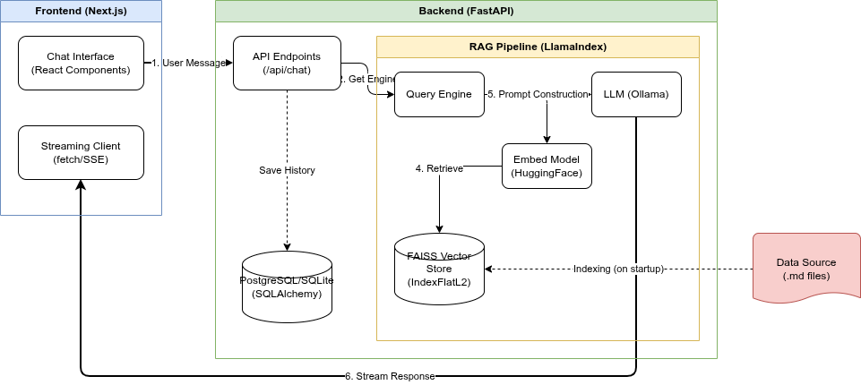

# AI Robotics Learning Assistant

A production-grade, RAG-powered educational assistant designed to teach robotics and electronics to students of all levels (from 2nd-grade beginners to senior engineering students).

## 🏗️ System Architecture

The application implements a modern Retrieval-Augmented Generation (RAG) architecture to provide grounded, context-aware educational support.



### Core Components
*   **Frontend:** Next.js 15 with Tailwind CSS and Framer Motion for a responsive, interactive chat experience.
*   **Backend:** FastAPI (Python) orchestration layer managing API requests, session persistence, and RAG logic.
*   **RAG Pipeline:** Built with **LlamaIndex**, utilizing **FAISS** for vector search and **HuggingFace** embeddings (`all-MiniLM-L6-v2`) for efficient local processing.
*   **Intelligence:** **Ollama** serving the `qwen2.5:1.5b` model, optimized for low-latency inference in resource-constrained environments.

---

## 🧠 How the RAG Pipeline Works

The assistant doesn't just "guess"—it retrieves verified knowledge from its custom robotics database.

1.  **Ingestion & Indexing:** On startup, the system processes 35+ structured markdown documents from the `/data` directory. These are chunked and converted into high-dimensional vectors.
2.  **User Query:** When a user asks a question, the query is embedded into the same vector space.
3.  **Semantic Retrieval:** The system performs a similarity search in the **FAISS vector store** to find the most relevant context chunks.
4.  **Age-Adaptive Prompting:** Based on the user's education level, the system selects a specialized prompt template (e.g., using analogies for kids, technical specs for engineers).
5.  **Augmented Generation:** The retrieved context + the specialized prompt + the user query are sent to the LLM.
6.  **Streaming Output:** The final grounded answer is streamed back to the UI in real-time.

---

## 🚀 Getting Started

### Method 1: Docker Deployment (Recommended)

1.  **Initialize the Stack:**
    ```bash
    docker-compose up --build -d
    ```

2.  **Pull the LLM Model:**
    ```bash
    docker exec -it ollama ollama pull qwen2.5:1.5b
    ```

3.  **Access:**
    - **UI:** [http://localhost:3000](http://localhost:3000)
    - **API Docs:** [http://localhost:8000/docs](http://localhost:8000/docs)

### Method 2: Local Development

#### 1. Backend Setup
```bash
cd backend
python -m venv venv
source venv/bin/activate  # or venv\Scripts\activate on Windows
pip install -r requirements.txt
uvicorn app.main:app --reload
```

#### 2. Frontend Setup
```bash
cd frontend
npm install
npm run dev
```

---

## 📂 Project Structure

- `/frontend`: Next.js application and UI components.
- `/backend`: FastAPI server, SQLAlchemy models, and LlamaIndex RAG pipeline.
- `/data`: Knowledge base containing 35+ robotics component profiles.
- `/storage`: Persistent FAISS index storage.
- `docker-compose.yml`: Multi-container orchestration.

---

## 🛠️ Tech Stack

- **Frameworks:** Next.js 15, FastAPI
- **RAG:** LlamaIndex, FAISS, HuggingFace
- **LLM Engine:** Ollama (Qwen2.5)
- **Database:** SQLite/PostgreSQL (via SQLAlchemy)
- **Styling:** Tailwind CSS, Framer Motion
